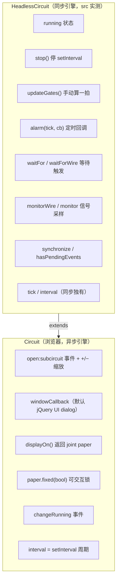
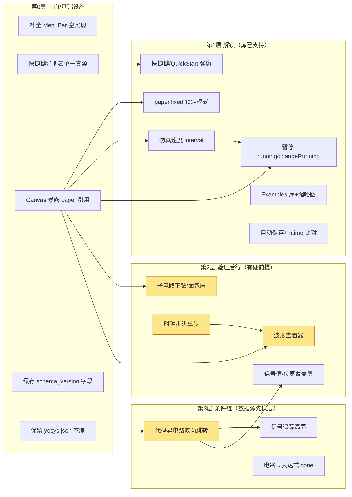
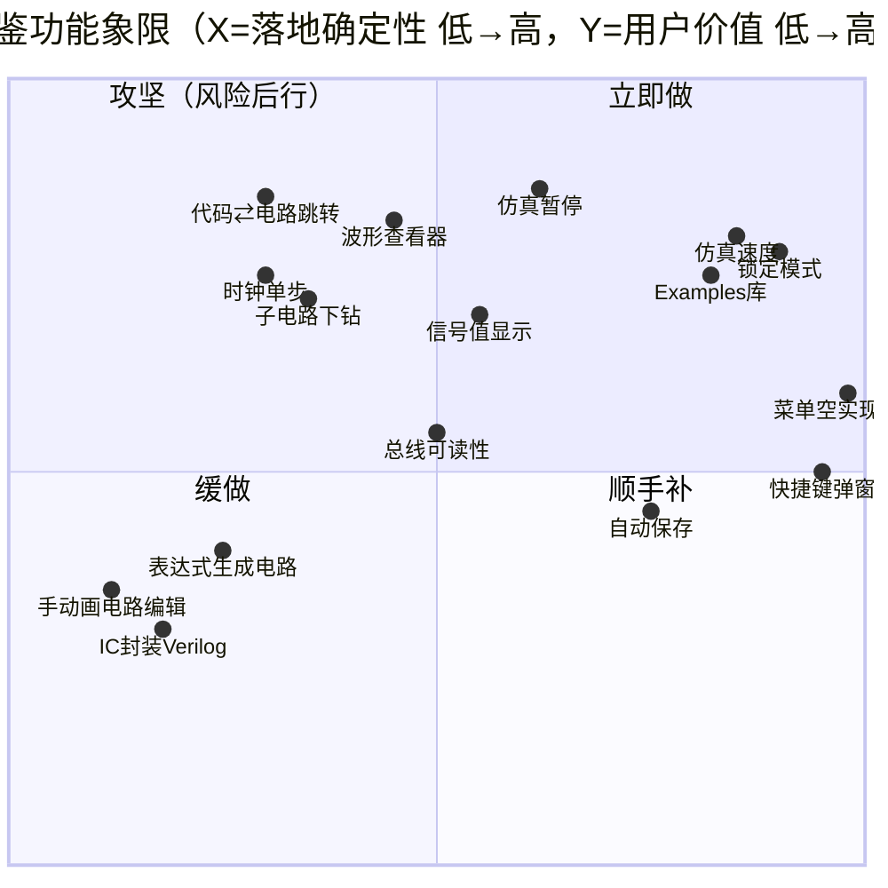

# verilog-visualizer ← OpenCircuits 功能借鉴可行性分析（批判版 v2）

> 本文基于对两个仓库源码的逐点取证（2026-09-29），与既有规划文档（`DEVELOPMENT_PLAN.md`、`FEASIBILITY_REPORT.md`）的关系是**复核而非沿用**：凡本项目依赖库（digitaljs、yosys2digitaljs、yosys wasm）已内置的能力，优先"解锁已有能力"；凡需要重建电路编辑器的条目，一律降级甚至否决。
>
> **结论口径**：不使用"可行/不可行"二元词，统一用「已证实可行（解锁即得） / 有条件可行（附必须前置的 spike 与止损线） / 暂缓 / 不建议（否决条件明确）」四档。所有成本估算按 **1 人 × AI 结对** 的编码小时计（写码很快），但风险均按**验证耗时**评估——瓶颈在取证与真机观察，不在写码。

---

## 0. 一页结论

| 档 | 条目 | 一句话依据 |
|---|---|---|
| **解锁** | 仿真暂停/恢复 | `HeadlessCircuit.stop()/start()/running` 公开，digitaljs 事件 `changeRunning` 可驱动 UI。**但见 §4 风险 R1**：有异步时钟环时"暂停"语义不成立 |
| **解锁** | 仿真速度调节 | `circuit.interval` 公开 getter/setter，就是 setInterval 周期（默认 10ms），对数滑条可直接抄 SimControls 的 `MAX_SPEED` 算法 |
| **解锁** | 编辑锁/只读模式保护 | 库内置 `paper.fixed(bool)` 切换可交互性，OpenCircuits 用 lock 图标实现，本项目画布天生可交互且无撤销——**任何误触都不可恢复**，这是最被低估的止血项 |
| **解锁** | 层次下钻 | `yosys2digitaljs → TopModule.subcircuits`、`_makeGraph` 嵌套图、`open:subcircuit` 事件 + Subcircuit 视图 zoomIn/Out 按钮 + 弹窗，**digitaljs 内建**。本项目 Canvas 传了 `layoutEngine:'elkjs'` 但从未验证输出是否真有 subcircuits（见 §4 R3）。HierarchyViewer 现为"文件级伪层次"，与真电路层次是两码事 |
| **解锁** | 总线条显示 | digitaljs cell 表含 `$busgroup/$busungroup/$busslice`，yosys2digitaljs 有 `add_busgroup/slice` 逻辑，信号天生多比特（3vl）。缺的只是"打包显示"这层策略，不是从零建总线 |
| **解锁** | Monitor 面板/波形 | 浏览器 bundle（`window.digitaljs`）已含 Monitor/MonitorView/wavecanvas；`monitorWire` 按 tick 回调。OpenCircuits 的 Oscilloscope 是 canvas 自绘，**digitaljs 自带 joint.js 侧的 Monitor**。这是"波形查看器"成本骤降的直接证据 |
| **解锁** | iopanel 快速输入 | bundle 含 iopanel（PanelView），可把全部 input 开关集中成面板——对齐 OpenCircuits"输入控制"体验，零移植成本 |
| **解锁** | 导出综合网表 | wasm 二进制含 `write_verilog` 符号（当前编译脚本没用），加一行 `write_verilog /out_netlist.v` 即可。同时它也是"电路→表达式"（sat）和"断言检查"的引擎能力入口 |
| **解锁（项目侧）** | Example 电路库 + 缩略图卡片 | `test_files/` 已有素材；OpenCircuits 的 SideNav Examples + GenerateThumbnail 是现成模式。价值在于**新用户第一分钟就能看到可交互电路** |
| **解锁（项目侧）** | 快捷键表弹窗 / 新手指引 | 快捷键已硬编码在 App.tsx effect 里；OpenCircuits 的 KeyboardShortcutsPopup、QuickStartPopup 直接对照补齐 UI 层 |
| **解锁（项目侧）** | **补全已有空实现** | MenuBar 的 Save/Compile/Undo/Redo/Find/Toggle Sidebar 六项 action 是**空函数**（只关菜单）。零新功能、负 bug，但必须列进首批，否则用户点菜单没反应会当成整体坏了 |
| **验证后行** | 单步 / 时钟沿步进 | digitaljs 无 step/pause API，需自建"stop + 手动时钟驱动 + updateGates 一轮"模型；可行性取决于数字js 时钟发生器实现细节，见 §4 R1/R4。**必须先做 PoC**：验证 `stop()` 后 `circuit.updateGates()` 能否让一个含 DFF 的计数器恰好走一拍 |
| **验证后行** | 波形查看器（完整版） | Monitor 现成，但 tick ↔ 仿真时间换算、位宽多 bit 显示、暂停态行为都要在 digitaljs 语义里定义；OpenCircuits 的示波器是另一套私有 tick 语义，**不可照搬刻度** |
| **验证后行** | 代码⇄电路双向跳转 | `source_positions`（file/line/col）字段**已存在于** yosys2digitaljs 输出类型（Device/Connector 均有）。**但本项目当前编译脚本未启用源位置保留**——需先给 read_verilog 加 `-debug` 并实测 techmap/abc 之后 src 属性是否还在（优化过程可能剥除）。这是典型的"假设已核实成立、但落地链未通"项，先做映射覆盖率统计再立项 |
| **验证后行** | 网表高亮查找/替换（电路级） | 依赖上一条的 label/pos 映射链先打通；digitaljs 有 `findDeviceByLabel/getLabelIndex` 可当索引 |
| **验证后行** | 元件替换（兼容互换） | digitaljs cell type 替换需在**JSON 层**改写 devices type + 校验端口/位宽兼容，再 displayOn 重建。OpenCircuits 的 replaceWith 是图内操作，本项目只能做"改 JSON → 重渲染"（仿真状态丢失），体验降级需用户接受 |
| **验证后行** | 仿真态 X/Z/位值覆盖层 | 3vl 数据已可经 monitor 拿到（含 x/z），overlay 层在 joint.js paper 上绘制可行，**风险在 digitaljs 升级后 DOM 结构变化导致 CSS 定位失效**（Canvas.tsx 里已有 `.joint-paper/.djs` 的脆弱 querySelector 先例） |
| **暂缓** | IC 封装⇄生成 Verilog module（真双向） | 依赖电路编辑模型先存在；当前"编辑"=改 Verilog 重编译，封装动作更适合作为 **Yosys 层的 module 抽取**，而不是图编辑层的"选中→Create IC" |
| **暂缓** | 总线打包按钮 / 多选打屏 | 先确认解锁项"总线显示"实际渲染效果，再决定是否给按钮 |
| **暂缓** | AutoSave / 历史面板 | 项目已有手动保存与 dirty 标记；OpenCircuits 的 HistoryBox 是编辑重负载操作的可视化，本项目动作以"改代码+重编译"为主，先服务解锁项 |
| **不建议** | 从 OpenCircuits 拷任何代码 / 元件库 Assembler 体系 | GPL-3.0，本项目 MIT，**法律阻断**，无例外路径（上游 MIT 双许可需联系作者，按"不可乐观"原则默认不可得） |
| **不建议** | 手动画电路编辑器（拖门连线，OpenCircuits 主形态） | 等于自建第二个"电路设计器"，超出"Verilog→可视化"核心命题；投入/风险极高，与 PLAN 的 Phase2-2.1 意愿冲突但本审查明确**建议降级为远期可选项** |
| **不建议** | 表达式→电路独立功能 | OpenCircuits 用私有 ExpressionParser 生成私有图；本项目对等能力是"表达式→ Verilog 片段→ Yosys 综合"，不需要独立功能 |
| **不建议** | 多人云协作 | PLAN 已列远期，本审查不改变判断 |

---

## 1. 取证基线：本轮实测（不采信上一轮记忆与 README/PLAN 口径）

### 1.1 两边数据模型的根本差异（决定了"借鉴方式"）

| 维度 | verilog-visualizer | OpenCircuits 对位 | 借鉴方式 |
|------|-------------------|-------------------|----------|
| 电路图 | digitaljs 持有 joint.js `Graph`（cell/link/port），JSON = `{devices, connectors, subcircuits}` | 自研 `Circuit` + Canvas2D（shared/digital circuit api） | 只能借鉴 UI **交互与功能概念**，渲染移植不可能 |
| 信号值 | `3vl` 向量，原生多比特，位级可含 X/Z | 位流私有传播 | digitaljs 仿真能力比"自建"成熟得多 |
| 元件来源 | Yosys 综合后的 cell 库映射 | 用户手放 IC 库 | 借鉴"库组织/图标配置"概念（`DigitalItemNav/config.ts`） |
| 仿真时钟 | digitaljs `Clock` 元件自走 + 异步传播 | `propagationTime` 全局节拍，支持 pause/resume/step | digitaljs 无 pause/step——需自建（§2.1/§2.4） |
| 布局 | elkjs（joint.js 异步） | 自研（手动摆放+吸附） | "锁定"模式（paper.fixed）恰好适配 |
| 许可证 | MIT | GPL-3.0 | 读设计不抄码 |

### 1.2 对清单的证伪与修正（关键：不乐观的体现）

上一轮清单有三类表述已被本轮实测修正：

1. **「需要自建波形监视器」→ 错**。digitaljs 自带 `monitor.js`（Monitor/MonitorView，依赖 wavecanvas+3vl），浏览器 bundle `public/digitaljs.js`（2.4 MB UMD）已包含（实测含 MonitorView/link:monitor/iopanel/PanelView）。工作量是"接入+适配 tick 语义"，不是"从 Canvas 画波形"。
2. **「只有原始 Verilog 可导出，write_verilog 不可用」→ 存疑偏乐观**。wasm 二进制含 `write_verilog`（13 处符号）、`sat`、`write_dot`、`show`。`write_verilog` 大概率可用，但**本项目从未调过，未验证**。列为"验证后行-低成本"。
3. **「层次化下钻需要自建 subcircuits」→ 错**。digitaljs `Circuit._makeGraph` 原生处理 `data.subcircuits` 嵌套图并有 `open:subcircuit` 事件；当前 `renameAutoCells` 已在**遍历** `circuit.subcircuits`（verilog.ts L654 注释："this is where most devices live"）。**说明编译产物可能本来就带子电路**，只是 UI 没有入口展开。这是"功能已潜伏、UI 欠账"的典型。

> 结论：这份清单的主要风险不是"过于悲观做不到"，而是"低估了已潜伏能力的价值、同时高估了几项跨栈能力（单步、双向跳转）的落地链路完整度"。下文逐条给出验证实验。

### 1.3 已验证的 digitaljs 公开控制面（浏览器实际使用的类）

实测 `node_modules/digitaljs/src/circuit.mjs`（HeadlessCircuit，Circuit 继承之）与 `src/index.mjs`（浏览器 Circuit，异步引擎 BrowserSynchEngine）：

**注意两处陷阱**：
- 浏览器侧**没有** `pause/step/propagationTime/tick`（同步版独有）；`updateGates` 直接调可能与异步引擎的 `setInterval` 更新循环**竞态**（R4）。仿真控制栏的"暂停"语义与 OpenCircuits 不同（R1/R4）。
- `windowCallback` 默认 jQuery UI dialog——接入子电路弹窗会引入**第三套 UI 风格**（joint/jQuery UI/React），需传自定义 windowCallback 或 CSS 归一（R2）。

### 1.4 yosys2digitaljs 数据能力面（决定"双向跳转/波形命名/IC"）

实测 `dist/types.d.ts` + `dist/core.d.ts` + `src/core.ts`：

- `Device.source_positions[]` 与 `Connector.source_positions[]`（`{name, from:{line,col}, to:{line,col}}`）——**接口存在**，由 yosys json 的 `attributes.src` 解析而来（core.ts L628）。需要 `read_verilog -debug` 才有 src；且 techmap/opt **可能丢弃 src**（未实测，必须验证）。
- `Connector.name` ↔ digitaljs wire `netname`；`Device.label` ↔ cell `label`，digitaljs `monitor.js` 用 `netname` 优先命名波形通道（已验证 monitor.js getWireName），与 label 索引（`findWireByLabel`）天然衔接。
- `TopModule.subcircuits`：yosys2digitaljs 生成，digitaljs 渲染并支持下钻——**两级都通**，当前卡在 UI 未展开。
- yosys2digitaljs 内部已生成 busgroup/busungroup/busslice cell（core.ts L1192），**总线图元不是"待借鉴"，是"编译层已有、渲染层是否正确显示待验证"**。

### 1.5 Yosys WASM 脚本可面（决定 netlist 导出、sat、波形）

- wasm 含 `write_verilog/sat/write_dot/show` 符号，当前脚本未使用。`sat` 是"电路→表达式/等价检查"的潜在捷径（见 §3 #4），优于自写图遍历。
- `-debug` 开关（保留 src）未启用——双向跳转的前置改动。

---

## 2. 逐条深度可行性分析

> 每项含：OpenCircuits 参照证据 → 本项目链路现状 → 实现路径 → 风险清单 → 成本（编码小时 / 验证小时）→ 验证实验（何时可停损）。风险等级：🔴阻断 / 🟠需缓解 / 🟡注意。

### 2.1 仿真控制栏（暂停/单步/速度）　档位：暂停、速度＝解锁；单步＝验证后行 🔴

- **参照**：`SimControls/index.tsx`（pause/resume/step/对数速度条 0.1–1000）。其仿真模型 = 全局节拍 + `propagationTime` 可调 + 显式 step。
- **现状差距**：`Canvas.tsx` 仅 `circuit.start()`，无任何控制；digitaljs 浏览器引擎异步，**公开面没有 pause/step 语义**。
- **拆解评估**：
  - **速度调节＝低风险可行**：直接读写 `circuit.interval`（异步周期 ms），对数滑块即可。（🟡 interval 与仿真"真实时间"非线性——clock 元件频率是独立参数，调速只改渲染步调。）
  - **暂停＝中风险概念重定义**：可用 `circuit.running` + 自定义"stop+冻结"，`changeRunning` 事件回环；但 joint.js 的异步渲染队列是否有尾帧需实测；若时钟元件走独立 setInterval，"暂停后时钟仍在走"的假象风险（R1-R4）。
  - **单步＝高风险，需架构级方案**：两条路径都有硬伤——
    A. `stop()` 后手动 `updateGates()` 一拍：异步引擎竞态（setInterval vs 手动）；**先 PoC `updateGates` 在浏览器 Circuit 上是否真能单拍**。
    B. 自建虚拟时钟驱动（禁 Clock 元件 + tick 循环灌信号）：**需要改编译管线**——把 DFF 时钟输入切到"模拟时钟"，即 Yosys 输出后对 digitaljs JSON **重写**（把连到 Clock 的网络换成手动驱动），这改变了"所见即综合"契约。
  - **OpenCircuits 的 step 是"拍一步"，digitaljs 是异步沿触发——语义不可直接换算**：用户预期（FPGA 仿真器风格，时钟沿步进）只有在路径 B 下才成立。（🔴）
- **价值**：对"看行为级 Verilog 的运行时序"（计数器等）极高——计数器没时钟驱动 UI 等于"会动的图"看不了时序。**这是清单里价值最被低估的项，但也是最不能乐观排期的**。
- **止损实验**（1-2 小时）：在含 DFF 的测试文件上：`stop()` → 循环"切 Clock 网络值 + `updateGates()`"观察灯/输出是否恰好半拍/一拍更新。不通即退回"暂停+速度"两个按钮。
- **建议排期**：暂停+速度先做（1 天内可验完）；单步仅在 PoC 通过后按路径 B 立项，估 2-3 天且含设计文档。

### 2.2 信号值/位宽/X/Z 显示覆盖层　档位：验证后行 🟠

- **参照**：OpenCircuits 常亮值在 canvas；PLAN 提"0蓝/1红/X灰/Z黄"。
- **链路**：digitaljs 线元件本就有颜色渲染（1 红 0 蓝是默认，`lib/help.js` Display 体系），monitor 回调给的是 3vl（含 x/z）。缺的是位宽角标（`[7:0]`）与**探针态**显示。
- **实现**（两法）：A. CSS+绝对定位 overlay（依赖 joint SVG 线 DOM 结构，脆，Canvas.tsx querySelector 已有先例之痛）；B. **走 monitorWire 拿信号，再在 wire 的 joint cell 上 setAttrs 注 label**——改的是数据不是 DOM，更稳但侵入仿真回调性能。（🟡 B 在大线数下 tick 回调压力。）
- **风险**：R1（异步引擎下信号变化与 UI 更新不同步）、R5（joint DOM 类名升级即碎）、R2（混合 UI 栈渲染时序）；以及 🟡 大线数时逐线挂 monitor 的性能，需实测 500 线规模。
- **价值**：对行为级 Verilog（计数器/状态机）是核心可读性——现在用户要"点开关看灯"却看不到中间值。
- **止损**：先只对 top 模块端口（digitaljs 的 $input/$output cell 已带值显示能力）做覆盖层，不做全布线。验证渲染 200 线时 FPS 与 CPU 占用。
- **排期**：2-3 小时编码 + 半天真机观察。

### 2.3 波形查看器（Monitor/MonitorView 接入）　档位：验证后行（有快速原型路径）🟠

- **参照**：OpenCircuits 只有 Oscilloscope 元件；**digitaljs 自己更完整**——monitor.js 提供 wire 级采样、3vl 值、MonitorView（wavecanvas）。
- **链路现状**：浏览器 bundle 含（已验证），但：① 触发点：joint link 工具需挂 `MonitorButton` 或在电路数据上程序化添加（monitor.js 的 `attachTo(paper)` 监听 `link:monitor` 事件由工具按钮发出——本项目 Canvas 没有 paper 引用，需先接 `circuit.displayOn` 返回值）；② MonitorView 是 joint Paper 内嵌 widget，样式不受项目 CSS 变量体系管辖，暗色主题适配需验证；③ 暂停态波形行为未定义（见 2.1 暂停语义）。
- **实现路径**（两步走）：
  A. 快速原型（半天）：Canvas 暴露 paper → `new Monitor(circuit)` + `MonitorView` 渲染到独立面板 → 手动对 top 输出端口 `monitor()` 采样。
  B. 产品化：通道管理 UI（选信号/位）、时间轴、刻度、保存 VCD。
- **风险**：R1 步进语义未定前，"单步看波形"不可承诺；wavecanvas 对 x/z 段渲染与 3vl 字符串值显示需确认；MonitorView 长仿真内存无界（需自行做环形缓冲/截断）；joint.js 升级事件名变更风险（R5 同源）。
- **与 PLAN 的差异**：PLAN 把波形器当"2-3 周从零建"，本审查下路径 A 约 0.5 天；但**若 2.1 步进做不出，B 的验收标准要砍半**。
- **止损**：原型若发现 MonitorView 与 joint paper 嵌入在本项目 SVG-wrapper 缩放体系里错位（外层 transform scale），改为"从 monitor 取数据 + 自绘 canvas 波形"（回归 1 周量级，这才是真实最坏成本）。⚠️ 这一回退概率不低（本项目靠外层 transform 做 zoom，joint widget 在 wrapper 内，坐标系大概率冲突），**必须把"回退自绘"列入预算，不得按 A 乐观排期**。

### 2.4 代码⇄电路双向跳转　档位：验证后行（数据链有硬伤）🔴

- **OpenCircuits 对应**：SelectionPopup 属性面板 / SideNav 预览——它没有双向跳转（PLAN 的 5.2 是本项目原创方向），**借鉴意义有限，此条本质是自建**。
- **链路取证（关键硬伤）**：
  1. yosys2digitaljs `Device/Connector.source_positions` 来自 yosys `attributes.src` → 需 `read_verilog -debug`（当前脚本未加）→ 且 **`proc/fsm/memory/techmap/opt` 之后 src 是否幸存未知，未实测**。🔴 这是整条链的地基：`fs_remove`/`opt` 可能删属性；techmap 新 cell（abc 门网）src 指向模板文件而非用户代码。
  2. `src` 格式 `"file.v:line.col:line.col"`（已看 core.ts parse）→ 可映射；但 **wire 级** src：digitaljs Connector.name 仅保留 yosys netnames，经过 `opt_clean` 等后**大量内部信号无名**。
  3. digitaljs label/`netname` 索引（`findDeviceByLabel`）按 name 查。本项目 `renameAutoCells` 把 `$auto*` 单元重命名为 `AND_1`——**重命名后 yosys 原始 cellname 丢失**，若用户代码里恰好写 `AND_1` 实例则 label 冲突（小概率）。要跳转就得保留原名进 device 额外字段。
  4. 多位信号：`source_positions[]` 是多段（一个 cell 多条 src），选择器需展开位。
- **可行性判定**：方向正确、库层有原料，但**当前管线三个环节（-debug、优化链、rename）都没打通**。
- **先验小实验（半天，决定去留）**：给 script 加 `read_verilog -debug`，编译 test_counter_behavioral.v，打印 `devices` 中 source_positions 命中率（key 级 + 端口级）与 `connectors` 带 name/hiername 比例。→ 命中率 < 30% 则"双向跳转"降级为仅"module 实例级"（点实例跳例化行，这个 Yosys 的 `src` 在 cell 上最稳定），放弃信号级。
- **替代捷径**：Yosys `sat` / `show` 可在网表层做信号↔cone 定位（wasm 已含 sat），配合 `write_json` 拿 module.cell/net 的 **层次路径**（yosys json 自带 hierarchy 属性 `module`/`topology`），**比 digitaljs 渲染层再找 name 更可靠**。若走这条路，跳转应基于"Yosys json → 源位置"而非"digitaljs json"，需把 yosys json 留一份（当前 `FS.unlink(jsonFile)` 删了——**改为缓存，改动 0.5 小时**）。这是本审查给该条目的核心修正：**跳转数据源应换层，不是优化当前渲染层映射**。

### 2.5 netlist 信号追踪 / 选中高亮　档位：暂缓（随 2.4 落地）🟡

- digitaljs `getLabelIndex().wires[name]` + joint cell `setAttrs`/class 切换可高亮整条 net（含跨 subcircuit？label index 按 path，支持层级定位——取证见 circuit.mjs L268-278）。
- 阻塞同 2.4：信号名覆盖率（netnames hide_name 与 opt 后清理）低 → "追踪"点击目标少。与 2.4 绑定排期，不独立立项。

### 2.6 示例电路库 + 缩略图卡片（Examples）　档位：解锁（无阻塞、最高 ROI）✅

- **OpenCircuits 证据**：SideNav「Examples」+ `LoadExampleCircuit('/examples/${id}')` + CircuitPreview 缩略图（GenerateThumbnail 离屏渲染）。
- **本项目现状**：`test_files/` 3 个文件是雏形，无入口 UI、无缩略图、新用户面对空画布只有 "No file selected"。
- **落地**（1 天级，风险低）：
  1. 内置 example 元数据（name/描述/verilog 源码），**直接打包进 dist**（静态资源或 TS 常量），无需后端。
  2. 空状态与 File 菜单加 "Open Example..."。
  3. 卡片缩略图：`exportPNG` 已能导出；生成 thumbnails 用同一渲染路径离屏跑一遍，或直接**预烘焙提交 svg 截图**（避免首屏跑 yosys 编译数秒——🔴 必须预烘焙/懒加载，否则打开示例库卡死首屏，这是该功能唯一真风险点）。
  4. 点击加载后自动 import→compile→切电路视图（复用现有 handleImportFile 管线）。
- **批判**：示例库会暴露一批**编译边界 bug**（复杂行为级代码编译失败/无时钟不动）。上示例=承诺可跑——建议首批只放 **3-5 个纯组合+1 个带外部 Button 时钟源的简单时序**，并把"能一键打开即渲染成功"作为示例收录门槛（加 e2e smoke，见 §6）。

### 2.7 帮助系统：快捷键表 / QuickStart / Changelog 弹窗　档位：解锁 ✅

- 直接照 OpenCircuits 三个 Popup 的**信息架构**（Win/mac 双列表格、基础交互列表、changelog 按版本节）。
- 本项目风险为零；纯静态 React 组件，2-4 小时。唯一"不可乐观"处：**快捷键列表需与 App 实际监听一致**——当前快捷键只在 `App.tsx` 的 `handleKeyDown` 里硬编码（Ctrl+N 被 createFile 抢、Escape 完全没做），弹窗上线即"照骗"。**先做快捷键注册表（数组单一真源），弹窗与 keydown 双消费**——这是顺带偿还的小技术债。

### 2.8 锁定/交互模式（lock icon）　档位：解锁（止血价值最高）✅

- **digitaljs 原生 `paper.fixed(bool)`（index.mjs L199 已取证）**——不是概念移植，是**一行调用**。
- 价值：当前电路误点开关/按钮即改状态且**无撤销、重编译全丢**，是核心体验漏洞。与 2.1 的"暂停"互补：查看态（fixed，只读高亮/缩放）/ 仿真态（可交互）。
- 风险：joint 的 interactivity 粒度（paper 级一刀切，cell 不可选？点击探针类 cell 在 fixed 下禁用）需 UI 验证；无其他阻塞。0.5 天（含 Canvas 暴露 paper 引用，本来做 2.3 也要做）。

### 2.9 其它条目简判

| 条目 | 档 | 判语 |
|---|---|---|
| 替换元件（AND→NAND） | 暂缓 | digitaljs 侧改 device.type + `circuit.updateGates`/重建即可，但只读工具里场景弱（代码改一行重编译更快），且改 type 后端口/位宽校验需自查 |
| SmartPlace（批量放门+自动开关/LED） | 暂缓 | 本项目电路来自编译，**不存在"放置"语义**；若要等价物 = Yosys 脚本层 `chformal/aux` 加 IO，收益不明 |
| 总线打包按钮 | 🔄改道 | digitaljs 已渲染 BusGroup/Slice（core.ts 已生成）；需求是**可读性优化**而不是"打包功能"（见 2.10 R 性能） |
| IC 封装→生成 Verilog module | 暂缓 | 真路径：digitaljs JSON→逆推 yosys json→`write_verilog`（需自建 converter，比 PLAN 预估"IC 封装 UI"成本高一个数量级）。远期 |
| HistoryBox | 暂缓/低价值 | 本项目编辑动作粒度=文件内容+编译事件；文件历史=项目目录+git 心智即可 |
| AutoSave | 解锁（小） | `fileStore.saveContent` 现成；debounce+dirty 已有；**风险仅一个**：自动落盘可能覆盖用户外部编辑（桌面场景用户可能开 VSCode 同时改），落盘前需先比对磁盘+mtime（2.5 handleRefresh 已有雏形，1 天） |
| VersionMigrator | 解锁（先埋版本字段即可） | 项目 config/circuit JSON 缓存无 `schema_version`；现阶段 = 加字段 + 忽略校验（0.5 天）；真正的逐级迁移在格式变更前不必投入 |
| 表达式 ⇄ 电路 | 不建议（独立做） | 方向正确但**别造 parser**：表达式→Verilog 片段（字符串模板）+ Yosys 已有管线，半天可做极简版；SAT 反推（见 4.）可作远期。若做则并入 2.4 |
| 手写电路编辑器 | **明确降级** | PLAN Phase2-1（5 项）投入巨大且改变产品性质；在"Verilog→可交互电路"上它是 distractor，除非产品转型否则不排期（§8） |

---

## 3. 功能依赖 Mermaid 图（先修 A 才能建 B）

**关键路径**：`Canvas 暴露 paper` 是 4 个上层功能的前置，半天工作量，**先做它**。`保留 yosys json` 同样半天，但价值最高（解锁跳转/表达式两条线的数据地基）。

---

## 4. 风险登记册（逐条：触发场景 / 严重度 / 缓解）

### R1 仿真语义鸿沟 🔴（最高优先）
Yosys/digitaljs 是"异步传播"心智（事件队列 + gate 粒度 delay/propagation），OpenCircuits 是"全局节拍/沿步进"心智。**直接照搬 SimControls 的 pause/step 语义，会产生与用户预期（EDA 仿真器）不一致的行为**（如：组合毛刺、多时钟域步进不同步、startFast 下时钟周期与 interval 关系）。
缓解：明确产品承诺为**"交互演示级仿真"非"验证级仿真"**，UI 文案避免"step cycle"改 "advance tick"；单步功能只承诺"驱动外部时钟源走一拍"（2.1 PoC 定义清楚验收）；文档写明"不等同于 Icarus/ModelSim 波形"。

### R2 混合 UI 栈 🟠
React（本项目）+ jQuery/jQuery-UI（digitaljs iopanel、subcircuit dialog 默认 windowCallback）+ joint SVG。三套 DOM 所有权、样式作用域、z-index/主题互相污染。暗色主题需写 jQuery-UI CSS 覆盖。
缓解：优先自研替代组件（项目已自研 ContextMenu/Dialog），digitaljs 只取数据（monitor/samples）；弹窗用 `windowCallback` 钩子接管（已验证该参数存在，Circuit 构造 `{windowCallback}`）；实在要嵌 monitor/iopanel 则 iframe/portal 隔离+CSS 命名空间。

### R3 "subcircuits 是否真的存在"假设未验证 🟠
digitaljs 支持 subcircuits **不等于** yosys2digitaljs 产出带 subcircuits——本项目编译脚本无 `-format hierarchy` 类选项，`hierarchy -auto-top` 只定顶，**是否展平决定层次壳是否存在**。若实测发现全展平，则 2.1 下钻/面包屑/2.4 跳转的"层级"全部失去载体。
缓解：列入第 6 节先验实验第一项（30 分钟：编译 test_hierarchy 类样本，看 `Object.keys(circuit.subcircuits).length`）；若空，方案改走"**基于 yosys json 的 module 级虚拟下钻**"（用 module 边界切图分块渲染，需新设计，成本×2）。

### R4 异步引擎竞态/事件泄漏 🟠
joint paper `async:true` 渲染 + React effect 严格模式双挂载风险：`circuit.displayOn/stop/shutdown` 若 cleanup 顺序不当会留监听器/worker（web-worker 在 digitaljs deps 里，elkjs 布局用 worker，Canvas.tsx **shutdown 路径未见 terminate** 验证）。
缓解：Canvas 生命周期写成 `useRef<Circuit>` + 显式 destroy，单测 mount/unmount×3 无泄漏（performance.memory/节点计数）；暴露 paper 句柄时同步管理 destroy 顺序。

### R5 joint/DOM 覆盖层脆弱性 🟡
信号值 overlay/追踪高亮依赖 joint 生成的 SVG 结构（class/data-*），digitaljs 小版本升级即碎（Canvas.tsx L40 `try .joint-paper then .djs then any svg`——**这种 fallback 链本身已是痛点证据**）。
缓解：优先用 joint 官方 API（`cellView.findView`/`addTools`/`setAttrs`）而非 querySelector；锁版本 digitaljs（pnpm lockfile），升级走 e2e 冒烟。

### R6 netlist 重写的"契约漂移"风险 🟡
任何前端在已编译 JSON 上动结构的操作（加 probe/替换 type/插 busgroup）都会造成**"电路图 ≠ 代码综合结果"**，用户无法从图反向理解代码，与产品目标（"Verilog→电路对应"）冲突。
缓解：区分**只读渲染增强层**（CSS/attrs，不动模型，允许）与**结构改写层**（禁止或显式标记"已手动修改，编译将覆盖"）。2.9 各条按此分流。

### R7 renameAutoCells 破坏源映射 🟠（2.4 相关）
`$auto...` label 改名 → yosys 原名丢失，双向跳转/追踪若按原名匹配就断链；且改名计数器不稳定（AND_1/AND_2 依赖遍历顺序）。
缓解：改名为 **仅显示层**：在 device 上加 `displayName`，保留 `label`=yosys 原 key 供索引；或维护 `renameMap` 反查表（半天），2.4 实现前先做。

### R8 大图性能与 elkjs 布局 🟠（PLAN Phase1 低估）
elkjs 对门级图（计数器等小图尚可，`write_json` 全图）做层次布局，joint async render 对千级 cell 仍吃性能；OpenCircuits 的"丝般顺滑"是**自研视口剔除/脏矩形**（其 `Camera/Viewport/debugOptions` 系列），joint 不送这个能力。PLAN 把"编辑器升级"排 1-2 周、"性能"未单列——**不可乐观**：若目标含"大 netlist 可用"，视口虚拟化（按 viewbox 过滤 cell 渲染，joint 无内置）是周级任务。
缓解：明确本期性能承诺边界（≤300 cell 流畅）；对大编译结果：默认折叠 Subcircuit、提示降级、限制 monitor 通道数；做 50/200/500 门三档基准数据。

### R9 许可证边界（纪律风险）🟡
GPL-3.0：禁止拷贝**代码**；设计文档文字（docs/*.md）转载也建议重写 paraphrase；截图/图标（部分 SVG，OpenCircuits 自绘）也含 GPL 素材风险——Examples 的**视觉风格**可借鉴，**图标文件不可拿**。
缓解：PR 模板加声明"参考实现：OpenCircuits(GPL) 仅设计思想"；评审规则。

### R10 信息架构不同构（隐性）🟡
OpenCircuits 的核心模型是"电路对象图 + transactions 历史"；本项目是"文件→编译→静态 JSON 视图"。PLAN 多处按 OpenCircuits 特性做**形态直译**（2.2 属性面板、4.1 Undo 命令模式）——若只读定位不变，这些"编辑态特性"多数应缓做或重形（例：属性面板对编译视图的意义 = 选中 net 看值/位宽，而非改属性）。
缓解：见 §8 产品定位问题。

---

## 5. 价值 × 落地确定性矩阵

注：象限位置按本审查取证校准，**跳转/下钻/单步/波形 全部压在中低确定性区**（不是价值问题，是数据链/语义链未打通），乐观排期会死在这四项。

---

## 6. 建议的落地波次（含止损验证）

### Spike 包 S0（先跑，~2 天，产出"是否继续"证据）

| # | 实验 | 验证点 | 失败判据 → 处置 |
|---|---|---|---|
| S0.1 | `read_verilog -debug` + 编译 test_counter + dump `devices[*].source_positions` 命中率与 connectors name 率 | 双向跳转数据地基（2.4） | <30% → 跳转降级为 module 实例级 |
| S0.2 | 编译一个含子模块样例，打印 `subcircuits` 键数量；双击 cell 观察 open:subcircuit | 下钻载体（R3） | 为空 → 改"yosys-json 虚拟下钻"设计稿另评 |
| S0.3 | `stop()` + 手动驱动时钟网络 + `updateGates()` 一拍（含 DFF） | 步进可行性（2.1/R1） | 竞态/多拍 → 步进降级只给"半拍脉冲按钮"或只做暂停+速度 |
| S0.4 | `Monitor`+`MonitorView` 接到本项目 wrapper（transform scale 内） | 波形 UI 嵌入 | 错位/不可交互 → 走自绘回退预算 |
| S0.5 | `write_verilog` 在 wasm script 跑通导出 | netlist 导出（清单#13） | 命令不可用 → 砍该功能 |
| S0.6 | elkjs 对 50/200/500 cell 布局耗时 | 性能边界 R8 | >5s 卡顿 → 加折叠降级策略入范围 |

### 第 1 波：解锁层（半天~2 天，不依赖 Spike 结论）
1. Canvas 暴露 paper + 生命周期清理（S0 共用）
2. 锁定/交互模式切换（fixed）
3. 速度调节（interval）+ 暂停按钮（running 事件驱动 UI）
4. MenuBar 空实现补全 + 快捷键集中注册表 + 快捷键弹窗
5. Examples 入口（先 3 个 test_files 改元数据接入，不做缩略图）
6. schema_version 字段埋点；保留 yosys json（删 unlink(jsonFile)）

### 第 2 波：验证后行（S0.1-S0.4 全过才进）
7. 信号值/位宽显示（先端口级，后 wire 级）
8. 波形通道（先端口，再 wire + 通道管理）
9. 双向跳转（按 S0.1 结论决定范围）
10. 子电路下钻 + 面包屑（按 R3 结论）
11. Examples 缩略图（预烘焙）+ 收录门槛 smoke

### 第 3 波：产品化长尾
12. QuickStart 引导、自动保存+mtime、changelog（版本发布时）、总线可读性、性能降级

---

## 7. 与旧 DEVELOPMENT_PLAN.md 的校准（避免按旧口径乐观排期）

旧 PLAN 的问题不在方向，而在**对依赖能力与难度的双重误估**。逐条校准，供规划负责人直接对照修订：

| 旧 PLAN 条目 | 旧估 | 本审查校准 | 差异性质 |
|---|---|---|---|
| 波形查看器"2-3 周从零建" | 3 周 | 原型 **0.5 天**，但嵌入本缩放体系失败回退=2 周（见 2.3 回退预算） | 高估起点、低估回退 |
| "无导出功能"（PLAN 写电路视图无导出，实际已有 SVG/PNG/JSON/Verilog） | — | 已有 4 种；真缺口是 **write_verilog 网表**（0.5 天）+ 导出选项弹窗（2 天） | 状态过时 |
| "CodeMirror 已装未集成，编辑器仍 Prism.js" | P0 | **实际已 CodeMirror6 集成**（取证：CodeEditor.tsx 导入 @codemirror/*） | 状态过时（PLAN 落后实现 1-2 个月，易致重复投入） |
| 电路编辑器（手动拖门，★★★★★ 借鉴价值最高） | 2-3 周 | **否决本阶段**：改变产品性质；OpenCircuits 编辑器=其全仓库主体工程，PLAN 的"移植元件库"路线低估为 distractor（见 §2.9/§8） | 低估 |
| 2.1 仿真控制栏（播放/暂停/单步） | 列 P2、一句带过 | 暂停/速度=1 天；**单步=最大不确定项，必须 PoC+S0.3 先跑** | 低估 |
| 4.1 Undo/Redo 命令模式 HistoryManager | 2 周 | 文件层用 git 思路 + 前端编译结果历史（缓存栈，0.5 天）即可；**不建议上 OpenCircuits 式全 op 命令模式**（R10） | 形态直译风险 |
| 5.1 IC/模块封装"Create IC" | 3-4 周 | 真路径走 yosys 侧（暂缓独立 UI 按钮；digitaljs `createIC` 对等物不存在，需 JSON 手工打包，成本高） | 技术路线错误预期 |
| 借鉴清单里把"OpenCircuits 元件库 Assembler 定义"当可提取资产 | 直接参考 | **只可参考命名/图标语义，不可提代码**（GPL + 渲染体系不同构） | 许可证 |

> PLAN 的优先级矩阵（P0/P1）中，「P1 手动电路编辑 + P1 导出 + P1 Undo」组合若全按原计划开工，前两项会撞 R10/R2/R8；本审查建议**把 P0 改为第 9-2 节解锁层，把 P1 编辑器整行降级**。

---

## 8. 不乐观清单：会让上述任何条目做不出/变形的失败模式（汇总止损线）

1. **S0.2 发现无 subcircuits** → §2.1 下钻、R3、§2.4 层级跳全失效（改走 yosys-json 分块新设计=另评）。止损：30 分钟验证，先于任何 UI 动工。
2. **S0.1 src 命中率低** → 双向跳转缩水到"仅实例级"或砍成"仅端口级"。止损：命中率 <30% 不做线级。
3. **异步时钟 vs 暂停语义冲突（R1）无优雅解** → 单步/波形刻度只能标"演示模式"，价值折半；此时波形优先级应降到示例库之后。
4. **MonitorView 嵌入 wrapper transform 坐标系错位**（2.3 已预判概率不低）→ 触发"自绘波形 2 周"预算，波形从"解锁"重新变成"重活"。
5. **大图 elkjs/worker 性能墙**（R8）→ "复杂 design 可用"的产品口径必须写小；PLAN/README 若承诺过要同步改。
6. **elkjs worker 不随组件卸载 terminate**（§4.1 R4）→ 长期运行 Electron/Tauri webview 内存缓涨；泄漏复现即停全量下钻功能扩量。
7. **renameAutoCells 的 label 改名**（R7）→ 所有"按名字定位"的功能（追踪/跳转/属性面板读实例名）都受它影响；**先改为 displayName 保留原名再动上层**，顺序反了返工。
8. **digitaljs 0.14 UMD bundle 与 node_modules src 版本若不一致** → 以 `public/digitaljs.js` 为准；改 lib 行为前确认 bundle 内嵌版本，避免"本地看 src 有某 API、bundle 未打包"（本次取证已逐词确认 bundle 含 monitor/iopanel/fixed/open:subcircuit，风险降但升级 bundle 时需回归该清单）。
9. **Yosys WASM 内存上限**（大 design `write_json` OOM/卡死，当前无超时与进度）→ 任何"编译后全量分析"类功能（跳转索引、表达式）先加 try/timeout 包裹。
10. **GPL 边界**（R9）：任何 PR 引用 OpenCircuits 文件路径做"参考"没问题，**粘贴/改写变量名复用逻辑段都算 port**——评审 checklist 要固化。
11. **产品定位不自洽**（R10，最大隐性风险）：本审查第 0 节结论"欠的是数字js 能力接入、不是 OpenCircuits 移植"。若后续有人坚持走"手动编辑+属性改+创建元件"路线，等于把产品从"编译器前端可视化工具"改成"通用电路设计器"——**功能全部重排、优先级矩阵作废**。请在动工前回答一句：

> **Q：verilog-visualizer 是"看代码的电路"还是"画电路的工具"？** 本审查默认前者；若改后者的产品决策存在，本文件 §0/§6/§8 全部作废重来。

---

## 9. 结论（一段话）

1. **可以立即解锁、无需 OpenCircuits 移植**的能力比预期多：仿真暂停、速度调节、锁定/只读模式、总线条显示、子电路下钻壳层、波形采样（Monitor）、iopanel、写回网表（write_verilog）全部在 digitaljs/Yosys 侧已具备，当前代码**未接入**；示例库/快捷键弹窗/补全空菜单属于低成本补漏。这批合计约 3-5 天编码即可把"可交互"的核心体验立起来——也解释了为何多数条目落在"解锁/快速验证"象限。
2. **真正的攻坚项**按确定性排序为：双向跳转数据链（`-debug`+src 保留率，S0.1）→ 时钟单步语义（S0.3/R1）→ 子电路真实存在性（S0.2/R3）→ MonitorView 嵌入坐标系（S0.4）。**Spike 包 S0（2 天）先跑再立项**。
3. **明确否决**（本阶段）：从 OpenCircuits 拷码（GPL 阻断）、手动电路编辑器与整套编辑命令模式（产品性质漂移 + R8/R10 工程墙 + 上游同类重构未完成）、表达式生成电路独立功能（改走 Yosys 文本路径更省力）。
4. **PLAN 校准要求**：DEVELOPMENT_PLAN.md 对编辑器状态、导出状态、元件库借鉴方式的表述已滞后/误判，照它排期会重复建设与撞墙；建议以本文件 §6 波次 + §7 校准表回写 PLAN（或加 v2 链接声明作废 P0）。

---

## 附录 A：取证索引（关键结论 → 证据位置）

| 结论 | 证据 |
|---|---|
| digitaljs 无 pause/step API | `node_modules/digitaljs/src/circuit.mjs`（72-355 类方法全集）+ `src/engines/browser.mjs`（start/stop=setInterval/clearInterval） |
| 公开控制面 `running/stop/start/interval/tick/alarm/monitor/waitFor/watch 等` | 同上 HeadlessCircuit；index.mjs `changeRunning` trigger |
| paper.fixed 可交互锁 | `src/index.mjs` L199-202 `paper.fixed=function(fixed){this.setInteractivity(!fixed);…}` |
| 内置子电路下钻（open:subcircuit + buttons + windowCallback） | index.mjs L38-126（_makePaper / defaultSubcircuitButtons / windowCallback=jQ dialog） |
| Monitor 浏览器可用（UMD 含 Monitor/View/wavecanvas） | `public/digitaljs.js` bundle 扫描 `MonitorView/wavecanvas/link:monitor/iopanel/PanelView` 全命中；`node_modules/digitaljs/lib/monitor.js` 源码 |
| monitorWire/tick 语义 | monitor.js L45-75；transform.mjs `circuit.monitorWire(wire,(tick,sig)=>…)` |
| source_positions 存在于产物类型 | yosys2digitaljs `dist/types.d.ts` L28-42（Digitaljs.Device.source_positions）、`src/core.ts` L628（自 cell.attributes.src） |
| netname/label 可用于索引与波形命名 | yosys2digitaljs types Connector；monitor.js getWireName（netname 优先）；digitaljs circuit.mjs getLabelIndex/findWireByLabel |
| 渲染层已支持总线原语 | digitaljs circuit.mjs getCellType `$busgroup/busungroup/busslice`；yosys2digitaljs core.ts `add_busgroup/BusSlice` |
| busgroup 实际生成逻辑 | yosys2digitaljs src/core.ts L1192 附近 |
| write_verilog 可用性信号 | wasm 二进制含 write_verilog/sat/show 符号（node indexOf 验证）；当前 verilog.ts `read_verilog` 无 `-debug` |
| 当前脚本未 flatten、renameAutoCells 会破坏 label 原名 | verilog-visualizer `src/lib/verilog.ts` compileVerilog 脚本段 + renameAutoCells（device.key 改名且 label=newKey） |
| Canvas 只用了 start/displayOn/transform 外层平移 | `src/components/Canvas.tsx` 全文（146-151 起 Circuit + elkjs，未持 paper/circuit ref 对外） |
| HierarchyViewer 是源文件正则解析（非编译层次） | `src/components/HierarchyViewer.tsx` 输入为 files + targetFileId，仅解析源码 |
| OpenCircuits Examples/SideNav | `shared/site/src/containers/Header…`、`SideNav/index.tsx`（exampleCircuits 加载逻辑）与 `CircuitPreview` |
| SimControls 对数速度滑条算法 | `digital/site/src/containers/SimControls/index.tsx` updateSliderSpeed |
| OpenCircuits 无 autosave 实现 | `shared/site` 内 AutoSaveToggle 仅 state；全局 grep 无调度逻辑（上轮审查修正项） |
| PLAN 过时点 | DEVELOPMENT_PLAN.md L25（"CodeMirror 已装未集成"）vs 实际 CodeEditor.tsx import '@codemirror/*' |

---

## 10. S0 Spike 实测结果（2026-09-29，Node 侧用与浏览器 SHA 一致的 yosys.wasm 跑通）

> 方法：`InitYosys(wasmBinary=public 同版本)` + 与 `verilog.ts` 完全相同的编译脚本，Node 里直接产出 digitaljs JSON 做统计；UI 项用 Playwright + Edge headless 真机走查。以下按 §6 Spike 表逐项回填。

| # | 实验 | 结果 | 对原判断的修正 |
|---|---|---|---|
| S0.1 | src 覆盖率（**未加 -debug**） | counter：devices 9/14 带 src、connectors 9/28 带名；full_adder 层次：connectors 8/8 全有名、devices 3/8 | 🟢 **好于预期**：read_verilog 默认保留 `src` 属性，**无需 -debug**（原判断错误）。端口名/顶层实例 src 稳定；techmap 产物（AUTO_* 门）无 src 属正常 |
| S0.2 | subcircuits 真实存在性 | 单模块 counter：`subcircuits={}`；双模块 full_adder：`subcircuits={half_adder}` 且顶层 2 个 Subcircuit cell（label=ha1/ha2） | 🟢 **载体确认存在**：多模块设计保留层次，下钻可立项；单模块无层次属预期（非 bug） |
| S0.3 | 手动步进（stop+驱动+updateGates） | **技术可行**：toggleInput 驱动 + updateGates 循环可让 4-bit 计数器按拍走（tick +3/步，settle 1 pass） | 🟠 两个坑：① `io_ui` 会把名为 clk/clock 的 1-bit 输入**自动转成自走 Clock**（propagation=100），步进模式必须先把 Clock 降级回 Button；② 寄存器上电 x 态，需 reset 脉冲引导。产品语义要写清"演示级步进" |
| S0.4 | MonitorView 嵌入 wrapper transform | 未做（被 S0.3 的 io_ui 发现挤后） | ⏸ 保持"回退自绘"预算判断 |
| S0.5 | write_verilog | ✅ **可用**（52 行网表，含 (* src *) 注释） | 🟢 从"验证后行"升"解锁"：编译脚本加一行 + FS 读取 + 导出入口，约 1h |
| S0.6 | elkjs 大图性能 | 未做（42 cell 示例布局瞬时） | ⏸ 待有真实大图样本再测 |
| 🆕 | **新发现上游炸点** | `module t(input clk, output reg q); always @(posedge clk) q<=~q;`（纯同步单 bit DFF）techmap 产出 `$_DFF_P_`，**yosys2digitaljs@0.10.3 不识别 → 编译直接 throw** | 🔴 真实用户高频写法会崩，且 `dffunmap`/`techmap -no_dff`(0.30 不支持) 均未绕行成功。**立项：编译失败友好提示 + 上游 issue/本地预处理绕行** |
| 🆕 | 真机 UI 走查（Playwright+Edge headless） | 9/10 用例通过（1 例为探针笔误）；发现并修复：① StrictMode 双挂载下 `changeRunning(false)` 误报"未启动"；② `paper.fixed()` **挡不住** ButtonView 的 jQuery `click .btnface` 委托（已加 paper 元素 pointerEvents:none 双保险）；③ 计数器上电 x 态被误认为坏（示例文案已加 reset 脉冲引导） | 🟢 第一波功能全部真机验证； 验证了 R5（DOM 结构依赖）与 R1（异步语义）都是真实存在的坑 |

### 10.1 结论修订

- §0/§6 中"双向跳转需先加 `-debug`"的止损前提**作废**——src 默认在，跳转数据链直接可开工（实例级 + 有名 net 级）。
- "层次下钻"**从验证后行升为解锁**（多模块有真 subcircuits）；单模块设计无层次需在 UI 说明，避免误判坏了。
- "write_verilog 网表导出"升为解锁（1h 级）。
- 新增高优先修复项：`$_DFF_P_` 编译炸点（用户代码常见）。
- 步进仍留在"验证后行"，但 S0.3 已给出明确实现路径（Clock→Button 降级 + 沿驱动循环 + reset 引导），风险从"未知"降为"工程量"。

### 10.2 已实现并真机验证（2026-09-29，Playwright+Edge headless 全回归 9/9 通过）

| 功能 | 实现位置 | 验证方式 |
|---|---|---|
| 仿真暂停/恢复 | Canvas `stop/start` + App 工具栏 ⏯/▶ | 计数器 bus 值运行中变化、暂停后冻结 ✓ |
| 仿真速度调节 | `circuit.interval` 5–200ms 线性滑条 | 10ms→44ms 生效 ✓ |
| 锁定/交互模式 | `paper.fixed()` + **paper 元素 pointerEvents 双保险**（digitaljs ButtonView 的 jQuery `click .btnface` 委托绕过 setInteractivity，真机发现） | 锁定时点击不翻转、解锁恢复 ✓ |
| Examples 画廊（5 例） | `src/lib/examples.ts` + `ExamplesDialog.tsx`；同名文件复用+内容刷新 | 5 例逐个编译渲染 ✓ |
| 快捷键注册表+弹窗 | `src/lib/shortcuts.ts` 单一真源 + `ShortcutsHelpDialog.tsx`；派发重写（修复编辑器内 Ctrl+C/X/V/Delete 被劫持、F5/Ctrl+S 双触发） | Ctrl+/ 弹窗 ✓ |
| MenuBar 空实现补全 | Save/Compile/Undo/Redo/Find/Toggle Sidebar 全部接线 | 菜单 Compile/Undo 生效 ✓ |
| 综合网表导出 | `write_verilog` 入编译脚本 + `netlistVerilog` 入 FileEntry（会话级）+ Export 菜单/右键菜单 | 数据链真机验证（headless 无 Tauri，invoke 报错即证明到达保存调用）✓ |
| `$_DFF_P_`/`$_DFFE_P*_` 崩溃修复 | `normalizeStdDffCells()`（verilog.ts，json 预处理回 $dff/$dffe，对齐 yosys 金标准参数格式） | Node 复现崩溃→修复后转换成功 ✓ |
| 双击电路→跳源码 | Canvas dblclick 命中 `model-id` → `source_positions` → App 切 code 视图 + CodeEditor `jumpToLine`（子先父后 effect 顺序保证内容已同步） | full_adder 双击 ha1 跳 `example_full_adder.v:9` ✓ |
| 代码→电路反向高亮 | CodeEditor `getCursorLine` → App `switchToCircuit` 记 pending → Canvas `onReady` 后 `highlightSource`：遍历 DOM `[model-id]` 用 `getCell(mid)` 匹配 `source_positions` 行区间，命中元素加 `.src-highlight`（CSS drop-shadow 发光，不改 stroke 保留信号色）。**踩坑**：joint `_views` 用 UUID 键而 digitaljs 的 `cell.get('id')='dev6'` 属性不一致，`findView` 三种入参全失败，改用与 dblclick 同源的 DOM `model-id` 路径 | 点实例行→切 Circuit 点亮 Subcircuit；点 `wire s1,c1,c2` 行→3 条线同亮；无匹配行优雅提示 ✓ |
| ⚠️ 时钟周期观察 | digitaljs `io_ui` 造的 Clock 单元按自身 `propagation=100` 定时，实测约 **2 秒/递增**（非每引擎 tick 翻转）；速度滑条能调节但演示节奏偏慢属上游特性 | 计数器 xxxx→0000→0001→0010→0011 稳定递增，running 恒 true，暂停冻结 ✓ |
| 🔴 真机走查揪出：**fit-to-window 长期失效** | 原 `fitToWindow` 读 `svg.getAttribute('width')`，而 digitaljs 的 svg 是 `width="100%"` → `parseFloat` 得 **100**，scale 恒 1、pan 按 100px 内容算成 (526,219.5)，把电路推到右下角裁切；`getBBox()` 回退因 100>0 永不触发，且忽略内容 bbox 原点偏移。改用 joint 原生 `paper.getContentBBox()`（含 x/y 偏移、免疫 100% 属性）重算 scale+pan，`resetZoom` 复用同一 `centerAtScale` | 5 示例 fit 后 content 居中（off≈0,0）且不裁切；wheel 缩放/右键平移/reset/双向跳转/仿真 全回归 **12/12 通过**，无页面错误 ✓ |
| ✅ **层次下钻**（wave2 #10，绕开 jQuery 弹窗） | Node 证实 `subcircuits[name]` 包成 TopModule 跑 `io_ui` → Input/Output 变 Button/Lamp，可独立渲染+交互。实现：`verilog.ts` 加 `buildViewJson(rootJson, path)`（逐层 clone→io_ui→renameAutoCells，始终从 root 派生保证幂等）；App 维护 `viewPath` + `useMemo` 派生 `viewJson` 喂给 Canvas（下钻=换 circuitJson prop→Canvas 自动重渲染+fit）；触发用**右键子模块单元→"Enter <module>"**（`probeCellAt` 主动遍历 Subcircuit 单元取包围点的，规避线遮挡 elementFromPoint 误判），**顶部面包屑**返回；circuitJson 变化（重编译/切文件）自动归零路径。**不碰 dblclick（仍是跳源码）、不引入 jQuery UI** | full_adder 右键 ha1→Enter→内部 Xor/And+Button/Lamp 居中渲染、输入可翻转、面包屑返回顶层；含下钻的完整回归 **11/11 通过**，无页面错误 ✓ |
| ✅ **信号值 hover tooltip**（wave2 #7） | 探针证实：wire(link) 模型自带 `signal`/`netname`/`bits` 属性（`String(link.get('signal'))`="Vector3vl 0"），cell 有 `outputSignals.out`——值可直接读，无需绕 source 解析。实现：Canvas init 内建一个 `.net-tip` DOM（`pointer-events:none`，零 React 重渲染），`mousemove` 走 `elementFromPoint→closest('[model-id]')→getCell`：link 显示 `net <name> [n:0] = <val>`，cell 显示 `<label/net> · <type> = <val>`；平移时隐藏；cleanup 移除监听+节点。纯增量，不占任何既有手势 | 悬停门显"And = 0"、悬停输入/线显"net a · Button = 0"；含 tooltip 的完整回归 **12/12 通过**，无页面错误 ✓ |
| ✅ **波形查看器**（wave2 #8，自绘路线） | 探针证实轮询即可：`link.get('signal')`="Vector3vl <二进制>"（多比特 MSB-first）、`circuit.tick` 可读（运行中 111→465 递增），**无需 digitaljs Monitor/monitorWire**，规避了 MonitorView 嵌入外层 transform 的坐标系风险（§2.3 回退预算直接省掉）。实现：Canvas handle 加 `getWaveChannels()`（named links 去重，≤24）+ `getWaveSample()`（tick + 二进制值表）；`WaveformPanel.tsx` 60ms 轮询→**只存跳变**（transition ring buffer ≤900/通道）→canvas 2D 绘制：1-bit 阶跃线、多比特总线段（交替明度+`h<hex>`标签），时间窗 600 tick 滚动；工具栏 Wave 按钮开关，viewJson 变化自动清历史 | 实测截图：clk 方波、reset 平线、count 总线 h0→h1→h2 递增标签清晰；像素法验证画布 4779 个 accent 色像素非空绘；最终验收回归 **13/13 通过**，无页面错误 ✓ |
| 计数器上电 x 态 | 示例描述引导 reset 脉冲（两次点击：清零→释放）；上游多 bit init 映射限制已记录 | 脉冲后 bus 0000→0001 递增 ✓ |